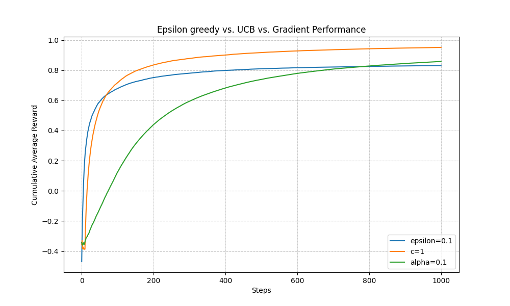

# Simulation of the multi-armed bandit  (Sutton & Barto, Ch. 2)

> **Summary:** > Constructed 3 classes of bandits($\epsilon$ greedy, USB, and gradient) and conducted multiple experiments to visualize how they behave.

## Visual Output

---

## 1. Objective & Architecture
* **The Problem:** A ML agent is faced with $k$ different actions, and each action returns a numerical reward based on an unknown stationary probability distribution(in this case, a Normal distribution with a randomly produced mean and a variance of $1$). The objective is to maximize the total reward through a set number of repetitions. 
* **The Approach:** Implemented 3 classes of bandits that run on different algorithms.
* **Tech Stack:** Python 3, Matplotlib

## 2. Mathematical Formulation
The core engine relies on the following dynamics:
Let $A_i, R_i$ be the action taken and the reward recieved on the $i$th iteration, respectively. Also, let $q_*(a)$ be the true mean reward of action $a$, and $Q_t(a)$ be the estimation of $q_*(a)$ at the $t$th iteration defined as 
$$Q_t(a) = \frac{\sum_{i=1}^{t-1} R_i \chi_{A_i=a}}{\sum_{i=1}^{t-1} \chi_{A_i=a}}$$
where $\chi_{predicate}$denotes the random variable that is $1$ if $predicate$ is true, and $0$ if it is not. If the denominator is $0$, assign the value $0$ to $Q_t(a)$. For each iteration, it is necassary to update the value of $Q_t(a)$, but letting $n$ be the number of times the action $a$ has been taking until the $t$th iteration, and $R_i$ denote the reward receieved after the $i$th selection of action $a$, using the above definition takes $O(n)$ time to update. Thus, letting $Q_n$ denote the estimated reward of action $a$ after it has been selected $n-1$ times, the following computation is more efficient:
$$Q_{n+1} = \frac{1}{n}\sum_{i=1}^n R_i = \frac{1}{n}((n-1)Q_n + R_n) = Q_n + \frac{1}{n}(R_n-Q_n)$$
This implementation only requires $O(1)$ time to update each time, so we will use this computation from now on.

We must also take in account the conflict between exploration and exploitation. Exploitation is when the agent takes its current knowledge and take the $greedy$ action, or the action that corresponds with the maximum prediction of reward. Exploring is when the agent selects a non greedy action wich enables the improvment of the current predictions. The following types of bandits use different measures to balance exploration and exploitation.

### a. Epsilon Greedy Bandit
* **Parameters:** $\epsilon:$ a small number in between $0$ and $1$ that defines the probability of choosing an exploration action. 
* **Algorithm:** For each iteration, with a probability of $\epsilon$, choose a random action, and with a probability of $1-\epsilon$, choose the action that gives the maximum value of $Q_t(a)$(more specifically, for the $t$th iteration, $A_t = \argmax_a Q_t(a)$), and update $Q_t(a)$.

### b. UCB(Upper-Confidence-Bound) Bandit
* **Parameters:**  $c:$ a positive number that controls the degree of exploration.
$N_t(a):$ the number of times that action $a$ has been selected prior to the $t$th iteration.
$\alpha:$ the stepsize parameter, which controls how much past information is reflected in the update of $Q_t(a)$(in the case of a. $\alpha = \frac{1}{n}$).
* **Algorithm:** For each iteration, if there are actions that has not been selected yet, then choose a random action from that group. If all actions have been selected at least one, then the $t$th action is chosen as follows:
$$A_t = \argmax_a (Q_t(a) + c \sqrt{\frac{\ln t}{N_t(a)}}) $$
* **Handling Non-Stationarity:** While the stationary case uses $\alpha = 1/n$, this causes the agent to become "stubborn" over time. For non-stationary environments where reward means drift, I implemented a constant step-size $\alpha \in (0, 1]$. This effectively weights recent rewards exponentially higher than older ones, allowing the agent to "track" shifting optimal actions. 

### c. Gradient Bandit
* **Parameters:** $H_t(a)$: the $preference$ (as defined later) of the action $a$ at the $t$th iteration, with initial value of $0$ for all $a$.
$\pi_t(a)$: the probability of choosing the action $a$ at the $t$th iteration.
$\alpha$: the stepsize parameter.

* **Algorithm:** For each iteration, the action is chosen with respect to the probability distribution $\pi_t(a)$, and the value of $\pi_t(a), H_t(a)$ is updated as follows, where $R_t$ is the reward receieved at the $t$th iteration and $\bar{R_t}$ is the average reward obtained prior to the $t$th iteration:
$$\pi_t(a) = Pr\{A_t=a\} = \frac{e^{H_t(a)}}{\sum_{b=1}^k e^{H_t(b)}}$$
$$H_{t+1}(A_t) = H_t(a) + \alpha (R_t-\bar{R_t})(1-\pi_t(A_t)), \quad \text{and} \\
H_{t+1}(A_t) = H_t(a) - \alpha (R_t-\bar{R_t})\pi_t(A_t) \quad \text{for all } a \neq A_t$$

## 3. Engineering Trade-offs & Edge Cases
* **Avoiding Overflow** For the gradient bandit, because $e^x$ easily grows explosively as $x$ increases, for each iteration, I calculated $h_t = \max_a H_t(a)$, and divided both the numerator and denominator of $\pi_t(a)$ by $h_t$ and calculated $\pi_t(a)$ as follows:
$$\pi_t(a) = \frac{e^{H_t(a)-h_t}}{\sum_{b=1}^k e^{H_t(b)-h_t}}$$
* **Using a Baseline to Reduce Variance**  In the gradient bandit, using $\bar{R}_t$ (the average reward) acts as a baseline. Mathematically, it doesn't change the expected update, but it significantly reduces variance. In simulations, removing this baseline led to significantly slower convergence, especially when the mean rewards of all arms were shifted far from zero.

## 4. Quick Start
\`\`\`bash
git clone [https://github.com/Sh1ntaro05/RL_seminar.git](https://github.com/Sh1ntaro05/RL_seminar.git)
pip install -r requirements.txt
python experiment_combo.py
\`\`\`