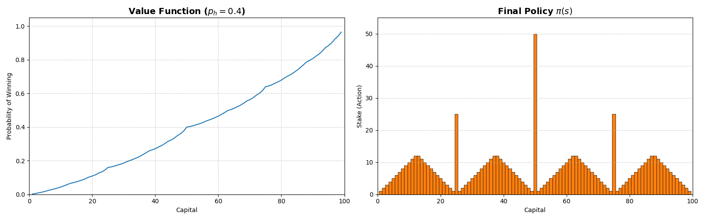
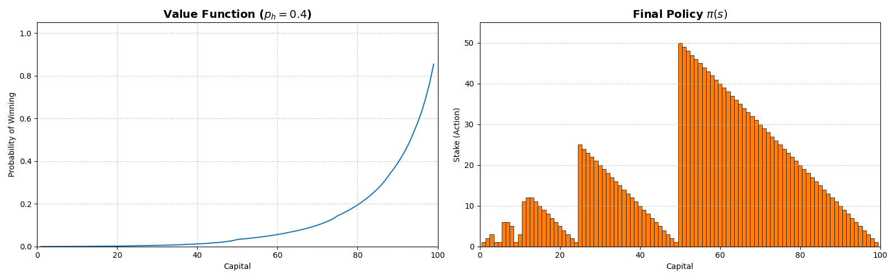

# Simulation of the Gambler's Problem (Sutton & Barto, Ch. 4)

> **Summary:** Two Python simulations determining the state value function and optimal policy for the Gambler's Problem, featuring both a static environment and a modified market-slippage environment.

## Visual Output



---

## 1. Objective & Architecture
* **The Problem:** Determine the optimal betting policy to reach a goal of $100 before ruin. The agent chooses a stake size per turn, winning the stake on a coin flip (heads) or losing it (tails). 
* **The Approach:** Implemented a Value Iteration algorithm to sweep the state space (current capital) and update the value function based on the optimal action, extracting the greedy policy upon convergence.
* **Tech Stack:** Python 3, Matplotlib

## 2. Mathematical Formulation

The core engine relies on the Bellman Optimality Equation for state values:
$$V(s) = \max_{a} \sum_{s'} p(s'\mid s,a)V(s')$$

* **Boundary Conditions:** $V(s) = 0 \quad (s \in \{0,1,\dots,99\}), \quad V(100) = 1.0$

**Environment 1: Constant Probability (Textbook Baseline)**
The probability of heads is static, representing infinite liquidity:
$$p(s+a \mid s,a) = 0.4, \quad p(s-a \mid s,a) = 0.6$$

**Environment 2: Exponential Decay (Market Slippage)**
The win probability decreases exponentially as the stake size increases, simulating order book slippage on large trades ($p_0 = 0.4, k = 0.05$):
$$p(s+a \mid s,a) = p_0 e^{-ka}, \quad p(s-a \mid s,a) = 1 - p_0 e^{-ka}$$

The Value Iteration sweeps terminate when the maximum value update ($\Delta$) falls below the threshold $\theta = 10^{-5}$.

## 3. Engineering Trade-offs & Edge Cases

* **Float Precision Stability:** The Gambler's Problem generates multiple actions with mathematically identical expected returns. I standardized expected returns to 5 decimal places prior to `argmax` evaluation to eliminate float-fuzz tie-breaking errors inherent to Python's float architecture.

## 4. Quick Start
```bash
git clone [https://github.com/Sh1ntaro05/RL_seminar.git](https://github.com/Sh1ntaro05/RL_seminar.git)
cd RL_seminar/Chp4Simulations
pip install -r requirements.txt
python gamblers_problem.py
python gamblers_problem_expv.py